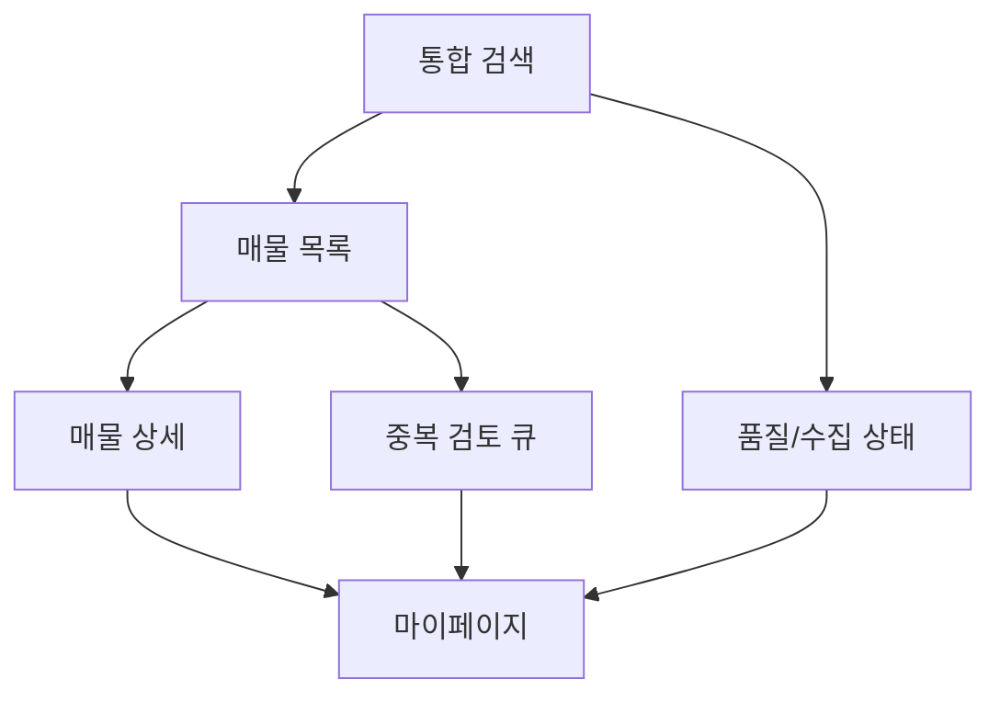

# 서울 원룸/투룸 통합 매물 서비스 UI 기획안

## 1. 문서 정보
- 기준 문서: `/Users/hyunsoo/personal-projects/my-rent-finder/docs/rent_finder_master_plan.md`
- 작성일: 2026-02-15
- 문서 목적: 마스터 설계안의 사용자 화면 요구사항을 기반으로 실제 화면 설계, 인터랙션, 데이터 표시 규칙, 운영 시나리오를 정리

## 2. 목표 및 핵심 UX 원칙
- 목표
  - 매물 탐색의 속도와 신뢰도를 높여 원하는 조건의 후보를 빠르게 찾을 수 있게 한다.
  - 자동 수집/매칭의 불확실성을 UI에서 명확히 노출해 의사결정 신뢰도를 높인다.
  - 중복 후보 관리(REVIEW_REQUIRED)와 품질 상태를 관리 화면으로 묶어 운영 효율을 높인다.
- 원칙
  - **빠른 탐색**: 기본 액션은 1~3회 터치(클릭) 내 완료.
  - **투명한 상태 노출**: 추정치, 경고, 실패/오류를 감추지 않고 라벨링.
  - **오탐 방지 보조**: 후보 간 차이를 시각적으로 강조해 사용자 판단 부담 완화.
  - **모바일 우선**: 집에서 PC, 이동 중 모바일 사용 모두 대응.

## 3. 타깃 사용자/사용 시나리오
- 1차 사용자: 서울 거주 희망자(원룸/투룸 단기 이동성 높은 사용자)
- 기본 여정
  1) 지역/가격/평수로 검색 설정
  2) 정렬로 후보 압축
  3) 상세에서 신뢰도/원본/이미지 상태 확인
  4) 후보 저장/신고/알림 조건 등록
  5) 필요시 중복 검토 큐로 이동해 오탐 조정
- 운영자 시나리오(보조)
  - 수집/정합성 상태를 모니터링해 임계치 초과 플랫폼을 점검

## 4. 전체 IA (Information Architecture)
1. **통합 검색**
2. **매물 목록**
3. **매물 상세**
4. **중복 검토(Review Queue)**
5. **품질/수집 상태 대시보드**
6. **마이 페이지(알림/신고 내역/저장 목록/설정)**

## 5. 화면별 UI 기획

### 5.1 통합 검색 화면 (MVP 1차)
- 레이아웃
  - 상단 검색 바: `시·구·동`, `월세 범위`, `평수 범위`, `월세 유형` 필터
  - 빠른 액션: 최근 검색 저장/초기화
  - 실행 버튼: `검색`
- 동작
  - 검색 실행 시 1건 이상 조건을 만족해야 함(지역은 필수)
  - 입력값 유효성 실패 시 필드별 인라인 에러 표시
- 기본 상태
  - 최근 조건 복원, 필수 조건 미입력 시 CTA 비활성
- 결과 연동
  - 결과 개수, 마지막 수집 갱신 시점 표시 후 목록 화면으로 이동

### 5.2 매물 리스트 화면
- 정렬/필터 패널
  - 정렬: 가격/거리/신뢰도/이미지 유무/갱신 시점
  - 고급 필터: `중개사`, `매칭 상태`, `업데이트 시점`, `플랫폼`, `이미지 개수`
- 카드 구성(1개 항목)
  - 썸네일, 월세/보증금, 면적(전용/공용), 지역, 층수
  - 신뢰도 배지(높음/보통/낮음)
  - 계약 위반·추정치 경고 라벨
  - 매칭 상태 뱃지 (`AUTO_MATCH`, `REVIEW_REQUIRED`, `DISTINCT`)
- 액션
  - 카드 탭: 상세 이동
  - 빠른 저장 버튼, 링크 직접 등록 유도 배너
- 목록 상단
  - 결과 수 + 현재 필터 요약
  - "리스트 새로고침" 및 "수집 상태 반영 마지막 시각"

### 5.3 매물 상세 화면
- 상단
  - 원본 출처(플랫폼, 최초 등록일), 정규화 값, 신뢰도 점수
- 콘텐츠 탭
  - 기본 정보: 주소/면적/가격/연락처/조건
  - 정규화 이력: 어떤 raw에서 유래했는지, 추정/원문 구분
  - 이미지 영역: 썸네일 기본 노출 + 필요 시 상세 이미지 확장 로드
  - 매칭 군 정보: 동일군 목록 요약(상세 토글)
- 상호작용
  - 링크 열기(원본 상세)
  - 중개사 신고 / 가격변경 신고 / 오탐 의심 신고
  - 저장(찜), 비교(향후 확장용), 알림 등록(옵션 조건에 맞는 경우)
- 상태 표시
  - `estimation_flag`가 true면 경고 배지
  - `contract_violations` 존재 시 주의 문구, 무시용 토글

### 5.4 중복 검토 화면 (`REVIEW_REQUIRED` 큐)
- 대상
  - 리뷰 상태 후보군을 우선 노출(최신성/오탐 이력 높은 순)
- 카드 항목
  - 후보군 대표 매물 + 대조 리스트(최대 3개) + 점수 + 이유 요약(reason_json 반영)
- 액션
  - `동일 매물로 병합`, `분리 유지`, `추가 검토 필요`
  - 선택 후 이유/메모 입력(운영자 판단 근거)
- 운영 도구
  - 임계치 범위 슬라이더(분석용, 실제 매칭 임계치 조정은 관리자 권한)

### 5.5 품질/수집 상태 대시보드 (운영용)
- 플랫폼 카드
  - 플랫폼명, 현재 모드(`API/STEALTH/BLOCKED`), 실패율(24h/7d), 최근 경보
- 파이프라인 지표
  - 수집/파싱/정규화/매칭 단계별 성공률 및 대기 큐
- 품질 지표
  - 완성도, stale, hallucination risk, contract_violations
- 액션
  - 플랫폼 강등/휴면 알림(운영 정책 안내 배지)
  - 실패 로그에서 조건별 필터

### 5.6 마이 페이지 (확장 화면)
- 저장 목록
- 신고/오탐 접수 내역
- 알림 조건(임대료/지역/면적 범위)
- 수집 조건 미리보기(사용자 입력 기반 검색 등록 이력)

## 6. UX 상세 규칙
- 라벨 규칙
  - `신뢰도 점수`는 색상 3단계(높음/보통/낮음)
  - 위험 표시는 경고 아이콘 + 텍스트(추측치/계약 위반)
- 일관성
 - 모든 카드/리스트에서 금액 형식은 `만원/월`, 면적은 `㎡ / 평` 동시 표시(초기값 ㎡)
- 접근성
  - 44px 이상 터치 영역
  - 키보드 포커스 순서 정합성, 필수 버튼 라벨 `aria-label` 제공
  - 에러/성공 토스트는 3초 이상 유지 및 재접근 링크 제공

## 7. 반응형 전략
- 모바일(<768px)
  - 1열 카드, 하단 플로팅 필터 버튼, 상세는 탭형 전환
- 태블릿(768~1199)
  - 2열 카드, 고정 필터 사이드 패널 슬라이드
- 데스크톱(>=1200)
  - 3열 카드, 좌측 영구 필터, 상세 우측 패널 확장

## 8. 데이터 상태 & 예외 처리
- 로딩
  - 검색/목록/상세는 스켈레톤 + 예상 완료 시간(대상 수집 플랫폼 평균) 표시
- 오류
  - 매칭 오류: 후보 없음 / 점수 저조 메시지 + 조건 완화 가이드
  - 플랫폼 수집 실패 알림: 대시보드 경보 연결
- 빈 목록
  - 조건 완화 추천 칩(최대 가격/평수/반경) 제안
- 상세 로딩 실패
  - 출처 링크 재요청/새로고침, 캐시된 기본 정보 fallback

## 9. 화면 우선순위 (MVP 로드맵)
- 1단계(필수)
  - 통합 검색, 매물 리스트, 매물 상세(신뢰도/경고), 링크 직접 등록
- 2단계(운영 품질)
  - 중복 검토 큐, 품질/수집 대시보드 핵심 지표
- 3단계(정교화)
  - 중개사/가격변경 신고 워크플로우 고도화, 알림 자동화 UI, 오탐 사유 편집기

## 10. 성공 지표(KPI)
- 목록 진입 후 2차 상세 진입 전환율
- 상세 진입 후 저장/문의 의도 버튼 클릭률
- REVIEW_REQUIRED 조치 처리 시간(P95)
- 목록 화면에서 `필터 완료->후보 노출` 소요시간
- 추정치 경고 노출 대비 무시율(UX 경고 신뢰도 개선 지표)

## 11. 오픈 이슈 / 다음 단계
- 디자인 토큰(색/폰트/간격), 컴포넌트 세트 별도 정의 필요
- 다크모드/컬러 모드 정책 미정
- 관리자 권한 레벨/권한 UI(검토/경고 해제) 정책 확정 필요

